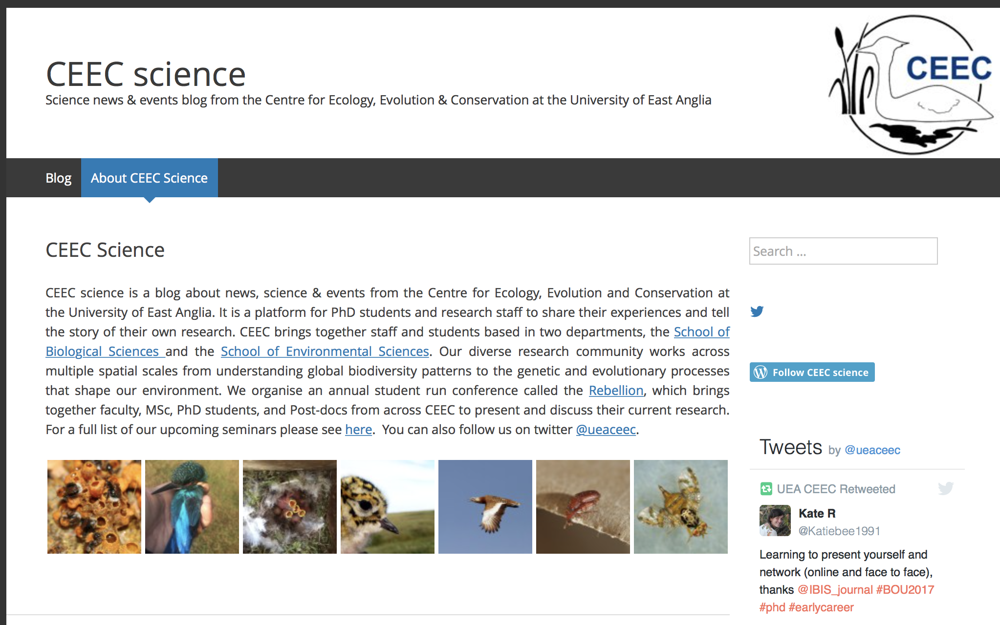
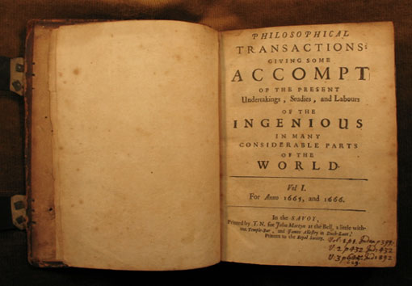
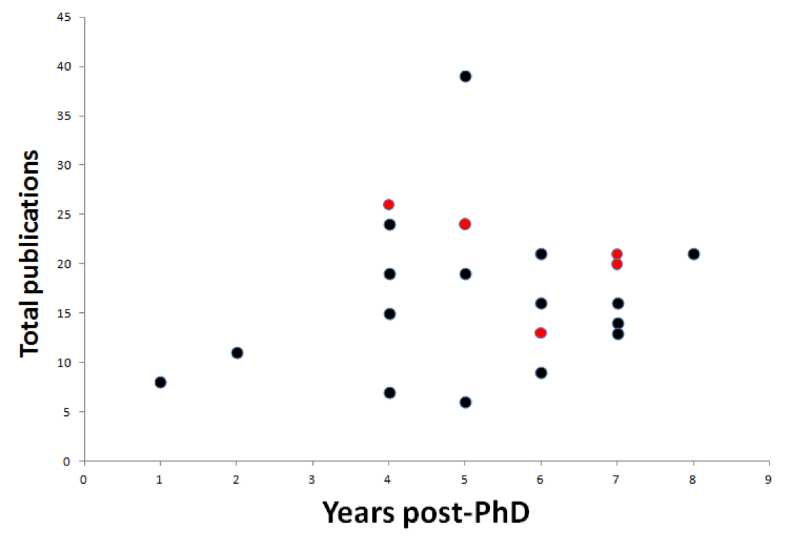
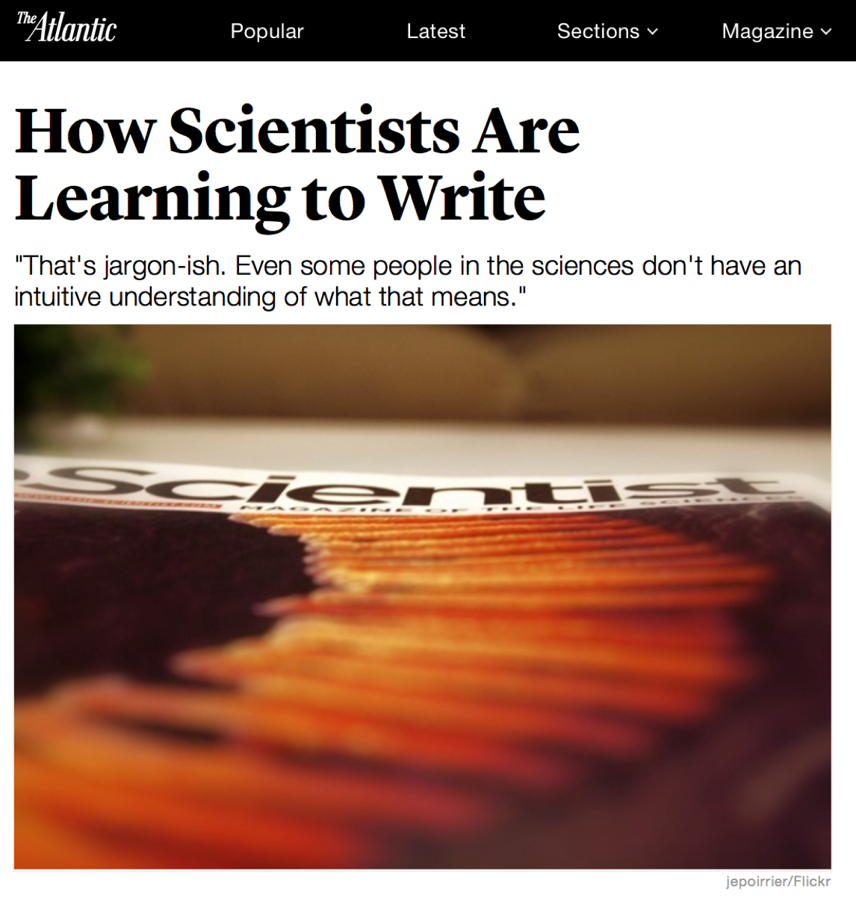

```{r setup, include=FALSE}
knitr::opts_chunk$set(echo = TRUE)
```


#Why publish your research?


## Lucky scientists

<div align="center">

</div>


## Who pays for all this then?

<div align="center">
<br>

</div>


## We have a duty to share

<div align="center">
<br>

</div>


## Publishing and academia

<div align="center">

</div>
<div align="right">
<p style="font-size:10px"> van Dijk et al. (2014) *Current Biology*</p>
</div>


## Publishing and academia

<div align="center">

</div>


## Common arguments against publishing research

<br>

- I'm not carrying on in science

- My results aren't significant

- My results aren't interesting


#How to write a paper


## How to write a paper

<br>
<br>

1. Write a paper

2. Make it good


#1. Write a paper


##1. Write a paper


<div align="center">
"The scariest moment is always just before you start"
</div>
<br>
<div align="center">

</div>


##1. Write a paper | Set up a workflow

1. Figures and tables
2. Results
3. Methods
4. Abstract
5. Introduction
6. Discussion


##1. Write a paper | Figures and tables
Figures and table should:

- Tell the story of your paper on their own
- Be informative
- Be clear
- Look nice


---
<div align="center">

</div>


##1. Write a paper | Results
- Structured around the figures
- Should be ordered logically
- Avoid intepretation (unless results & discussion combined)


##1. Write a paper | Methods

Usually something like:

- Field methods / broad experimental set up
- Molecular methods / specific experimental methods
- Statistical analyses


##1. Write a paper | Introduction

- What is your question and why is it interesting?
- What has been done to addresss it?
- What is the knowledge gap?
- How are you going to fill it?


##1. Write a paper | Discussion

- Almost a "reverse" of introduction
- Start with a summary of your results
- Place findings in context of wider research
- Don't just list all the things wrong with your study


#2. Make it good


##2. Make it good
<br>

- Know your stuff

- Write well


##2. Make it good | Know your stuff

- Read some papers
- Read some more papers
- Read some more more papers
- &c


##2. Make it good | Write well
- Write some stuff
- Write some more stuff
- Write some more more stuff
- &c

##2. Make it good | Write well

Start thinking of yourself as a writer

<div align="center">

</div>

##Know your stuff and write well

<br>
<br>

- Start reviewing manuscripts
- Critique the writing of everything you read
- Write summaries of key papers
- Write a science blog
- Write any blog
- Write anything


#Other tips

##Eliminate distractions
- Log out of email, turn off internet
- Put on headphones and look grumpy

<br>

<div align="center">

</div>


##Celebrate small achievements

<br>
<div align="center">

</div>


##REALLY celebrate big achievements
<br>
<div align="center">

</div>


##Some helpful tools

https://tomato-timer.com

http://writeordie.com

https://getcoldturkey.com


